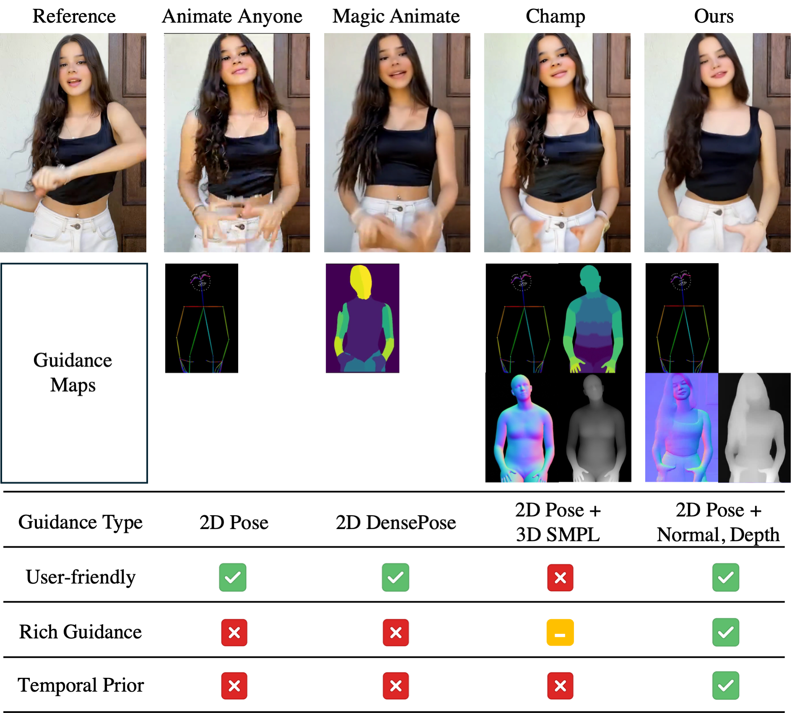
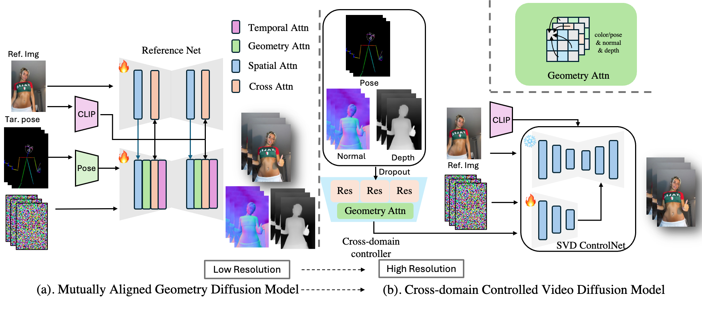

<h2 align="center"> 
   DreamDance: Animating Human Images by Enriching 3D Geometry Cues from 2D Poses
</h2>

</h5>
You can find the [dataset](https://pang-yatian.github.io/Dreamdance-webpage/resources/full_video_ids.txt) here.
Please visit our [project page](https://pang-yatian.github.io/Dreamdance-webpage/) for the video results.

<h3>

## 🌅 Motivation



## 📊 Framework



## 🗓️ TODO

- [x] We released [project page](https://pang-yatian.github.io/Dreamdance-webpage/) and [dataset](https://pang-yatian.github.io/Dreamdance-webpage/resources/full_video_ids.txt).
- [x] We released our paper on [arXiv](https://arxiv.org/abs/2412.00397)
- [ ] Update the inference and training code.
  
### Bibtex

```
@misc{pang2024dreamdanceanimatinghumanimages,
      title={DreamDance: Animating Human Images by Enriching 3D Geometry Cues from 2D Poses}, 
      author={Yatian Pang and Bin Zhu and Bin Lin and Mingzhe Zheng and Francis E. H. Tay and Ser-Nam Lim and Harry Yang and Li Yuan},
      year={2024},
      eprint={2412.00397},
      archivePrefix={arXiv},
      primaryClass={cs.CV},
      url={https://arxiv.org/abs/2412.00397}, 
}
```